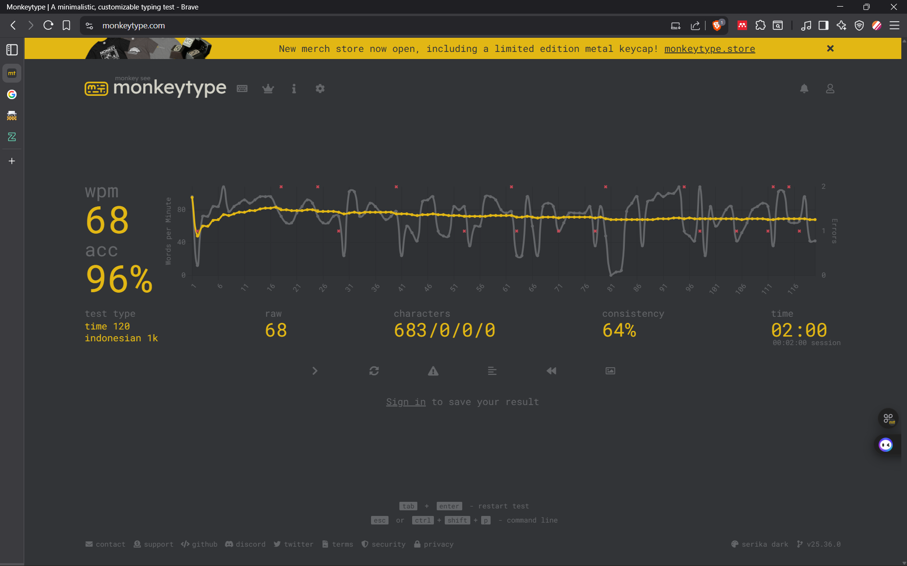
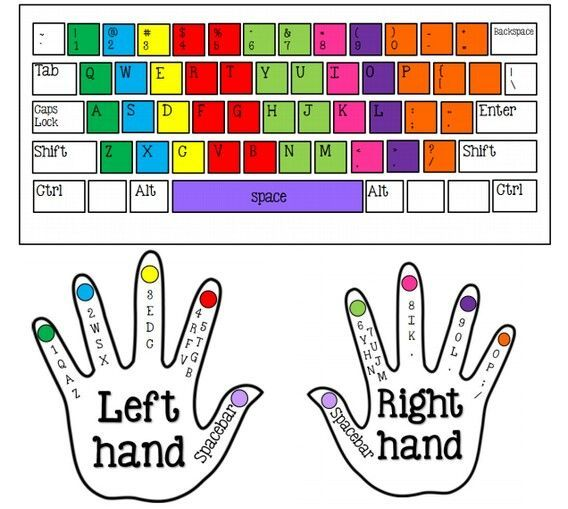
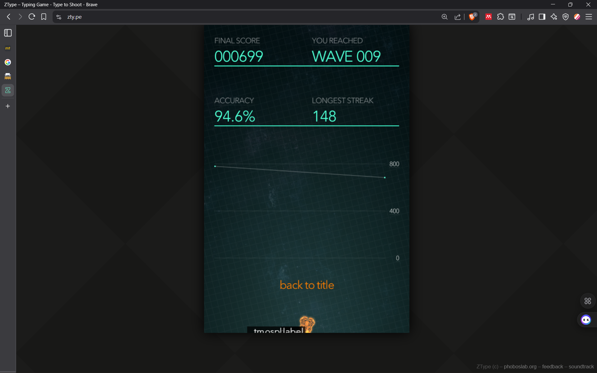
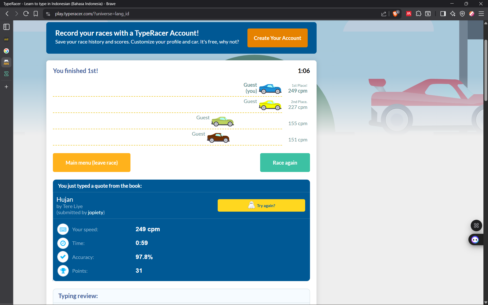

Nama: Achmad Hasan Al Fikri

NRP: 5025231052

Kelas: PBO A

 

Pada pertemuan pertama kelas PBO-A kali ini, membahas tentang kemampuan mengetik atau *type writing*.

Dalam hal mengetik, saya belum terbiasa mengetik dengan 10 jari, berikut hasil tes mengetik dari website MonkeyType dengan kebiasaan mengetik saya yang menggunakan sekitar 6-7 jari saja:

Dalam hal ini saya sadar bahwa dengan mengetik dengan 10 jari tentu hasil yang didapatkan jauh lebih baik, dari segi keakuratan dan kecepatan, tetapi memang saya rasa diperlukan latihan rutin.

Maka dari itu, pertama saya perlu mempelajari tata letak jari di keyboard untuk mengetik dengan 10 jari, yaitu seperti berikut:

Mempelajari *finger placement* di keyboard hanya sebagai langkah awal saja, saya tetap memerlukan latihan yang rutin. Memposisikan jari pada keyboard untuk mengetik 10 jari bagi saya yang tidak memiliki kebiasaan seperti ini sebelumnya sangatlah terasa sulit, saya perlu mengingat dan bahkan melihat catatan posisi jari diletakkan di sebelah mana. Namun saya percaya dengan latihan teratur dan rutin tentunya akan membangkitkan muscle memory dan akhirnya tidak perlu mengingat *finger placement* secara manual lagi

Beberapa platform latihan typing di internet juga sangat membantu dalam melatih kemampuan mengetik, terutama yang berbasis game karena lebih seru, interaktif, dan tidak membosankan. Beberapa platformnya seperti Z-Type, TypeRacer, dll. platform latihan typing berbasis game seperti ini dapat membangkitkan semangat latihan secara terus-menerus karena pasti ada 'pencapaian' yang dapat diraih, seperti nilai experience, level, juara/menang, dan lain sebagainya.

Saya berencana untuk rutin berlatih setiap hari dengan mengatur dan menerapkan jadwal latihan mengetik 3 x 10 menit dalam satu hari. 

Sekian, terimakasih
